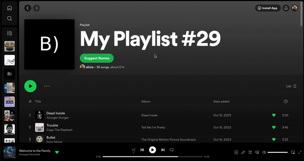

# Playlistify Extension

## Description
Chrome Extension that suggests Spotify playlist names by scraping data on the screen and using OpenAI.

## How to Use
1. Download the files
2. In contentScript.js, replace "YOUR_API_KEY_HERE" with your own OpenAI API key.
    * To get your own OpenAI API key, check out https://platform.openai.com/
3. Unpack files
    * Go to chrome://extensions/
    * Turn on Developer Mode
    * Click "Load unpacked"
    * Select files
4. Go to Spotify and open a playlist

## Troubleshooting
HTML Element not showing up on Spotify page?
* Make sure all adblockers are turned off
* Make sure your browser is up to date

## Questions?
Message me at destinyshi@gmail.com if there are any questions or problems.